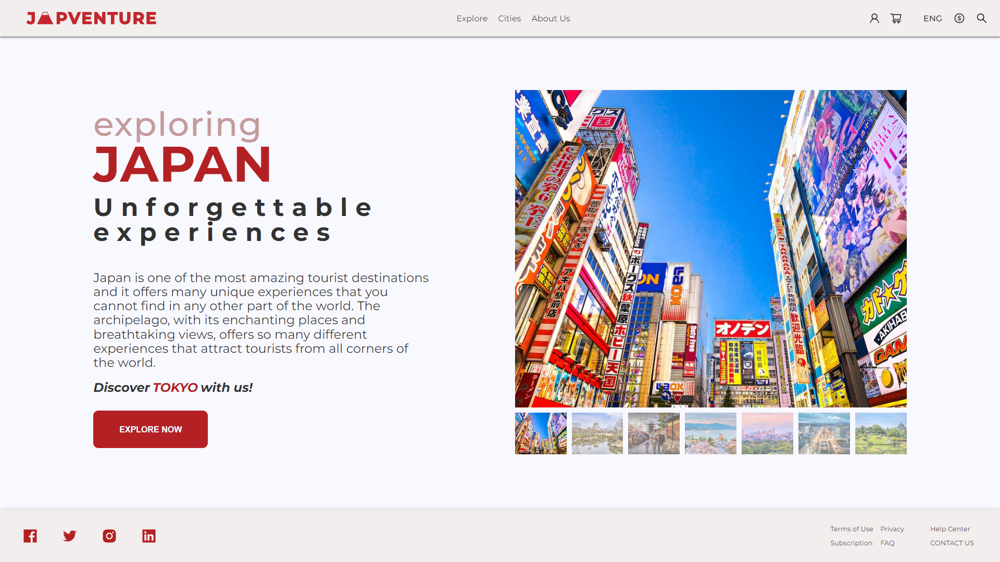
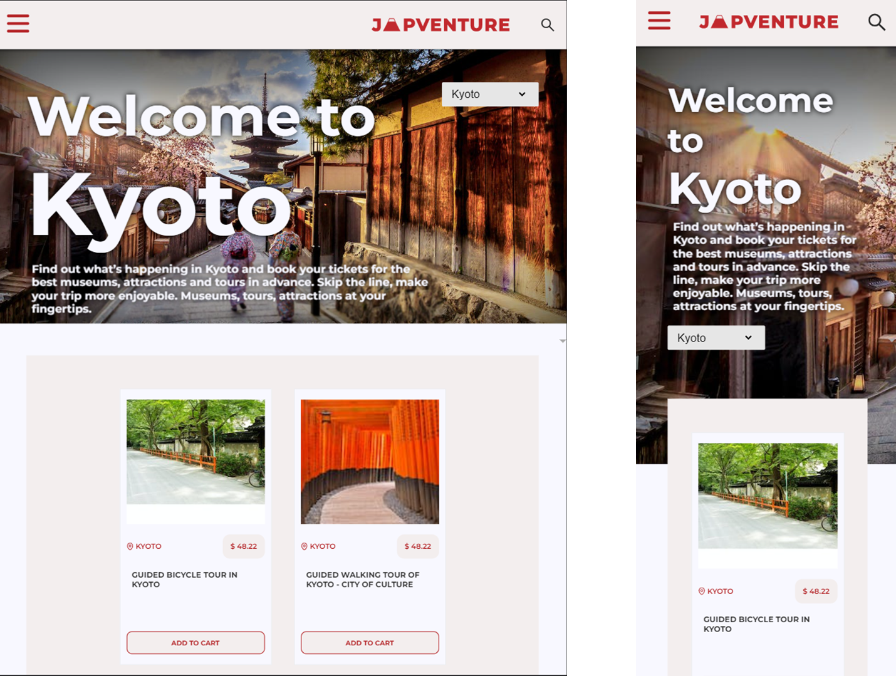

  

"Exploring Japan - Unforgettable experiences"

 ⛩️ Japventure is a tourism web-app for Japan, you can explore cities, activities, places and more! ⛩️ 

 
<h2> Technologies used </h2>
<ul>
<li>HTML5</li>
<li>CSS3/SASS</li>
<li>Javascript</li>
<li>React.js</li>
<li>CSS modules</li>
<li>Musement API</li>
<li>Google Maps API</li>
<li>Used Figma for designing</li>
</ul>
 

 <a href="https://project-south.vercel.app/">Japventure</a> 

